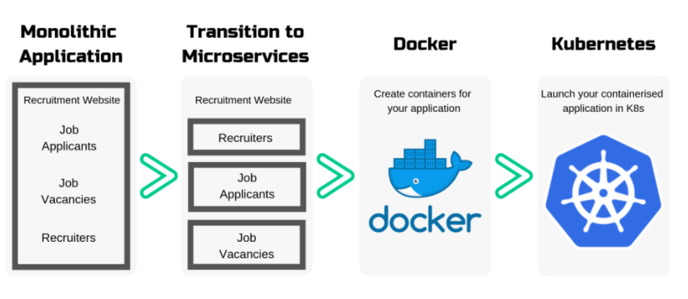
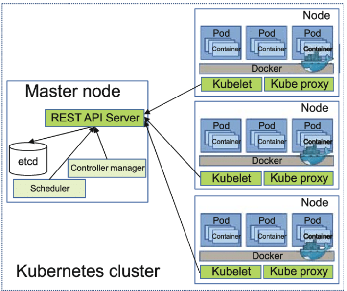

# Kubernetes Introduction

## What is k8s?
* Kubernetes is a portable, extensible, open-source platform for managing containerized workloads and services, that facilitates both declarative configuration and automation. It has a large, rapidly growing ecosystem. Kubernetes services, support, and tools are widely available.

## What are the benefits of using K8s?
* Agile application creation and deployment: increased ease and efficiency of container image creation compared to VM image use.
* Continuous development, integration, and deployment: provides for reliable and frequent container image build and deployment with quick and efficient rollbacks (due to image immutability).
* Dev and Ops separation of concerns: create application container images at build/release time rather than deployment time, thereby decoupling applications from infrastructure.
* Observability: not only surfaces OS-level information and metrics, but also application health and other signals.
* Environmental consistency across development, testing, and production: Runs the same on a laptop as it does in the cloud.
* Cloud and OS distribution portability: Runs on Ubuntu, RHEL, CoreOS, on-premises, on major public clouds, and anywhere else.
* Application-centric management: Raises the level of abstraction from running an OS on virtual hardware to running an application on an OS using logical resources.
* Loosely coupled, distributed, elastic, liberated micro-services: applications are broken into smaller, independent pieces and can be deployed and managed dynamically – not a monolithic stack running on one big single-purpose machine.
* Resource isolation: predictable application performance.
* Resource utilization: high efficiency and density.

## Why should we use k8s?
* Kubernetes provides you with a framework to run distributed systems resiliently. It takes care of scaling and failover for your application, provides deployment patterns, and more. For example, Kubernetes can easily manage a canary deployment for your system.

* Kubernetes provides you with:

    - Service discovery and load balancing Kubernetes can expose a container using the DNS name or using their own IP address. If traffic to a container is high, Kubernetes is able to load balance and distribute the network traffic so that the deployment is stable.
    - Storage orchestration Kubernetes allows you to automatically mount a storage system of your choice, such as local storages, public cloud providers, and more.
    - Automated rollouts and rollbacks You can describe the desired state for your deployed containers using Kubernetes, and it can change the actual state to the desired state at a controlled rate. For example, you can automate Kubernetes to create new containers for your deployment, remove existing containers and adopt all their resources to the new container.
    - Automatic bin packing You provide Kubernetes with a cluster of nodes that it can use to run containerized tasks. You tell Kubernetes how much CPU and memory (RAM) each container needs. Kubernetes can fit containers onto your nodes to make the best use of your resources.
    - Self-healing Kubernetes restarts containers that fail, replaces containers, kills containers that don't respond to your user-defined health check, and doesn't advertise them to clients until they are ready to serve.
    - Secret and configuration management Kubernetes lets you store and manage sensitive information, such as passwords, OAuth tokens, and SSH keys. You can deploy and update secrets and application configuration without rebuilding your container images, and without exposing secrets in your stack configuration

## Use cases
*  The use cases can be utilized together for different setups.
  - Self-Healing and Scaling Services : For simplicity, K8s process units can be detailed as pods and services. A pod is the smaller deployment unit available on Kubernetes. A pod can contain several containers that will have some related communication—such as network and storage. Services are the interface that provides accessibility to a set of containers. These services can be for internal or public access and can load balance several container instances.
  - Optimized Resource Usage with Namespaces : A K8s namespace is also known as a virtual cluster. Namespaces create a virtually separated cluster inside the real cluster. Clusters without namespaces probably have test, staging and production clusters. Virtual clusters usually waste some resources because they do not undergo continuous testing, and because staging is used from time to time to validate the work of a new feature. By using a virtual cluster, or a namespace, an operations team can use the same set of physical machines for different sets depending on a given workload.
  - Hybrid and Multiclouds : Both solutions are addressed by Kubernetes Federation. Multiple clusters — one for each cloud or on-premise data center — are created that are managed by the Federation. The Federation synchronizes computing resources, and even allows cross-cluster discovery: virtually any pod can communicate with a pod in another cluster without knowing the infrastructure. 

## When not to use K8s?
* Kubernetes is not a traditional, all-inclusive PaaS (Platform as a Service) system. Since Kubernetes operates at the container level rather than at the hardware level, it provides some generally applicable features common to PaaS offerings, such as deployment, scaling, load balancing, and lets users integrate their logging, monitoring, and alerting solutions. However, Kubernetes is not monolithic, and these default solutions are optional and pluggable. Kubernetes provides the building blocks for building developer platforms, but preserves user choice and flexibility where it is important.

## What are the competitors of K8?
* NetSuite.
* SAP ERP.
* Acumatica.
* SAP Business One.
* Sage Intacct.
* QuickBooks Desktop Enterprise.
* Oracle PeopleSoft.
* FinancialForce PSA.

## What are managed services for K8?
* Managed Kubernetes is when third-party providers take over responsibility for some or all of the work necessary for the successful set-up and operation of K8s. Depending on the vendor, “managed” can refer to anything from dedicated support, to hosting with pre-configured environments, to full hosting and operation.
  
## what is the difference between K8 managed service and non managed K8 services?
* 

## K8s cluster diagram

